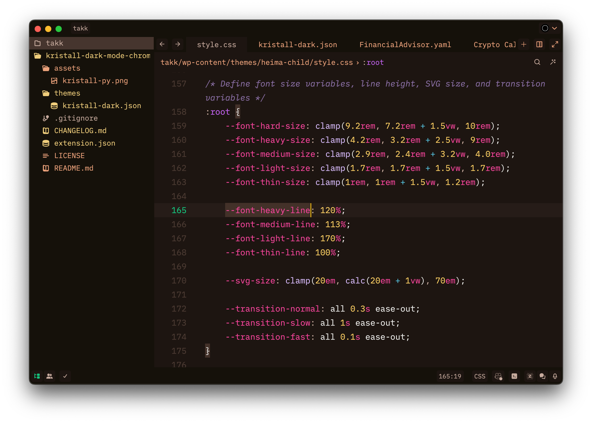
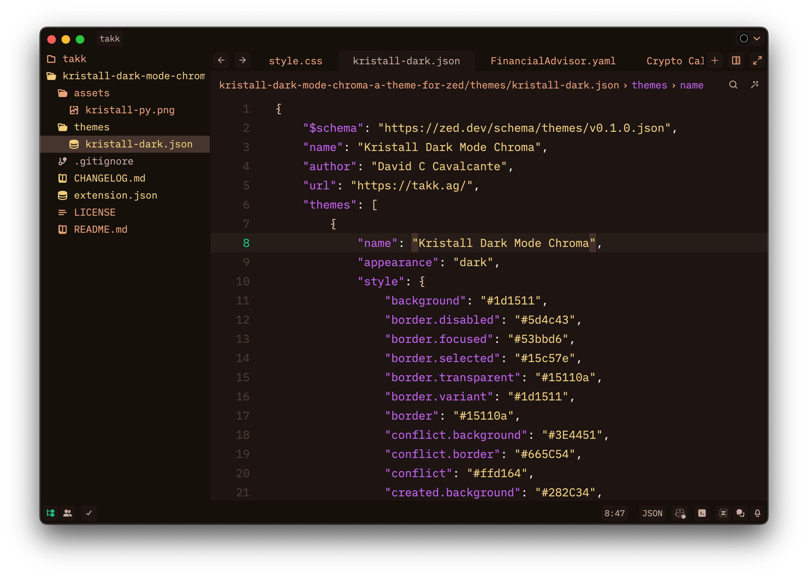
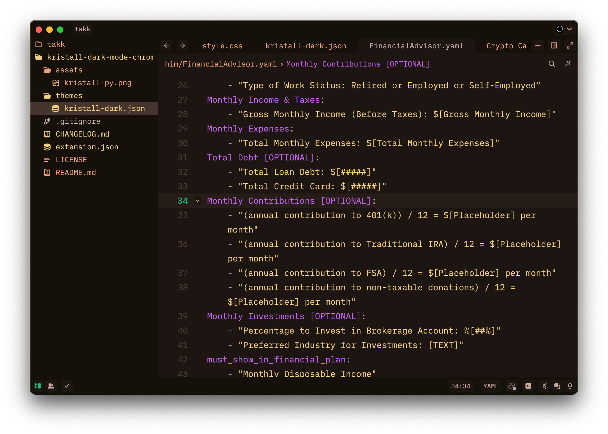
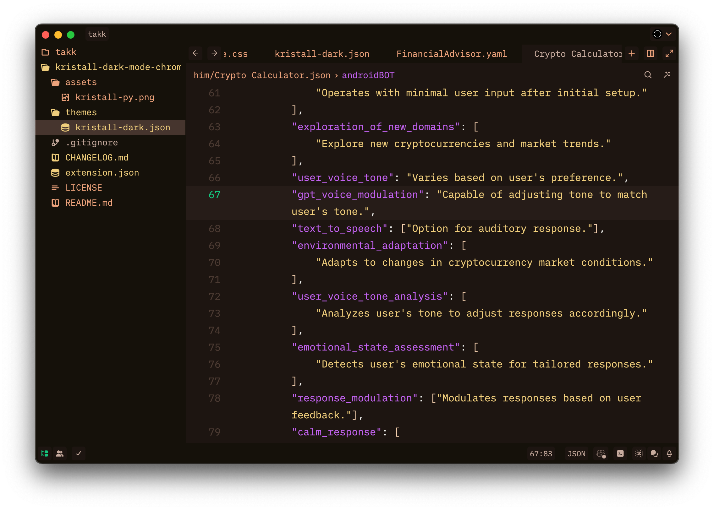
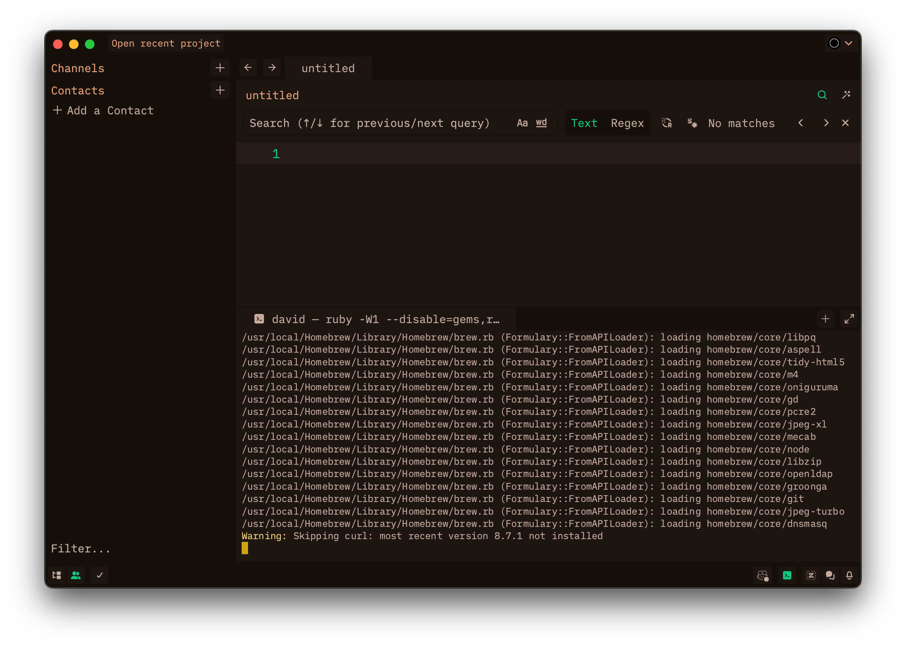

# Kristall Dark Mode Chroma Theme for Zed

The artistic vision of "Kristall Dark Mode Chroma" ventures into the realm of contrast between light and darkness, unveiling the allure of sombre and mystique beauty. It stands as a visual manifesto that goes beyond the conventional limits of observation, exploring the interplay between the enigmatic and the magnificent.

Here, "Kristall" transcends its literal meaning of transparency and crystalline elegance to embody the intricate layers and profundity of human experiences. Within the obscurity of the uncharted, the crystal emanates a compelling glow, presenting an aesthetic that harmonises complexity with simplicity.

Engaging with this artistic exploration, we are beckoned to delve into the human soul, to traverse the most veiled and unexplored facets of our cognition. "Kristall Dark Mode Chroma" confronts our established views, proposing an aesthetic journey that is both thought-provoking and sublime.

## Kristall Dark Mode Chroma Theme | CSS

## Kristall Dark Mode Chroma Theme | JSON

## Kristall Dark Mode Chroma Theme | GPT YAML

## Kristall Dark Mode Chroma Theme | GPT JSON

## Kristall Dark Mode Chroma Theme | Terminal

## Installation Guide

### 1. Manual Install

-   **Download**: Go to `themes` > `kristall-dark.json`.
-   **Add**: On your macOS, move the `kristall-dark.json` file to the folder `~/.config/zed/themes/`.
-   **Activate**: Type `theme selector: toggle` in the command palette.
-   **Search by**: `Kristall`, `Kristall Dark Mode Chroma`, `Takk Innovate Studio`, `Takk Design`, or `David C Cavalcante`.

### 2. Install via Zed

-   **Menu**: Go to `Go` > `Open` > `Command Palette...`.
-   **Type**: `extensions` or `zed: extensions`.
-   **Search by**: `Kristall`, `Kristall Dark Mode Chroma`, `Takk Innovate Studio`, `Takk Design`, or `David C Cavalcante`.

### 3. Activate the Theme

-   **Menu**: Go to `Go` > `Open` > `Command Palette...`.
-   **Type**: `theme selector: toggle`.
-   **Search by**: `Kristall`, `Kristall Dark Mode Chroma`, `Takk Innovate Studio`, `Takk Design`, or `David C Cavalcante`.

### 4. Support

Experience the power of ZED by visiting their official website today at [zed.dev](https://zed.dev/).

To contribute to public and social projects focused on research and artificial intelligence, feel free to support with any amount you prefer at [GitHub Sponsors](https://github.com/sponsors/Takk8IS).

## Beyond Consciousness in Large Language Models: An Investigation into the Existence of a "Soul" in Self-Aware Artificial Intelligences

PhilArchive: [Beyond Consciousness in Large Language Models](https://philpapers.org/rec/CRTBCI)

-   **USDT (TRC-20)**: TP6zpvjt2ZNGfWKPevfp65ZrcbKMWSQXDi

## Takk™ Innovate Studio

-   **Copyright (c)**
-   **License**: Attribution 4.0 International (CC BY 4.0)
-   **Author**: David C Cavalcante
-   **LinkedIn**: [David C Cavalcante](https://www.linkedin.com/in/hellodav/)
-   **Medium**: [David C Cavalcante](https://medium.com/@davcavalcante/)
-   **Positive results, rapid innovation**: Leading the Digital Revolution as the Pioneering 100% Artificial Intelligence Team
-   **URL**: [Takk Innovate Studio](https://takk.ag/)
-   **Twitter**: [Takk Innovate Studio](https://twitter.com/takk8is/)
-   **Medium**: [Takk Innovate Studio](https://takk8is.medium.com/)
